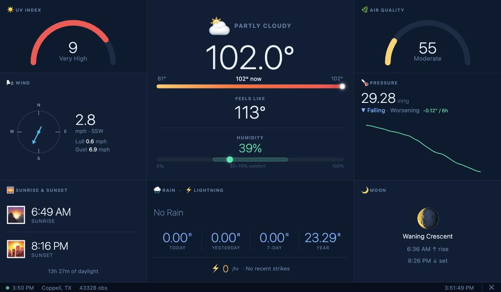
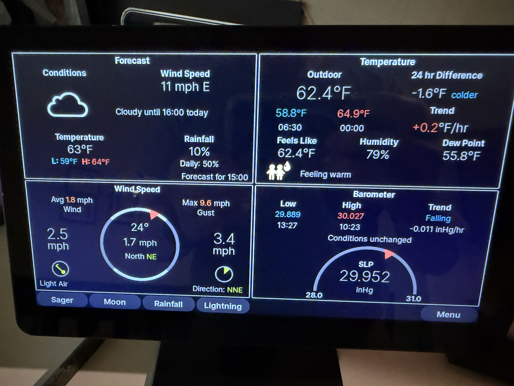

# Pi Tempest Weather Dashboard

A single-page touchscreen weather dashboard for the [WeatherFlow Tempest](https://shop.tempest.earth/) station, running on a Raspberry Pi. A 3×3 grid keeps every metric — conditions, UV, air quality, wind, pressure, sunrise/sunset, rain, lightning, and moon phase — on screen at once, no tabs, no scrolling.


*Current dashboard — 3×3 grid layout*


*Previous setup (WeatherFlow_PiConsole) — replaced by this app*

---

## Screen Layout

The dashboard fills the full 1024×600 display as a 3×3 grid (300px / 424px / 300px columns).

```
┌───────────────┬─────────────────────────┬───────────────┐
│   UV INDEX    │                         │  AIR QUALITY  │
│   arc gauge   │                         │   arc gauge   │
├───────────────┤       CONDITIONS        ├───────────────┤
│     WIND      │   icon · temp · range   │   PRESSURE    │
│  compass +    │   feels like · humidity │  value+trend  │
│  speed/gust   │   (hero cell, 2 rows)   │  + sparkline  │
├───────────────┼─────────────────────────┼───────────────┤
│  SUNRISE &    │   RAIN · LIGHTNING      │     MOON      │
│    SUNSET     │  intensity meter,       │  phase, rise/ │
│  + day length │  today/yesterday/7d/yr  │  set times    │
├───────────────┴─────────────────────────┴───────────────┤
│  ● Updated 14:46   Coppell, TX   43,021 obs             │
└─────────────────────────────────────────────────────────┘
```

The center "hero" cell spans the top two rows and shows current temperature with a color-graded high/low range bar and a humidity comfort band. UV and AQI use SVG semicircle arc gauges; wind uses an SVG compass with a live direction arrow. Pressure has a 12h sparkline drawn on a local (no-CDN) Chart.js.

---

## Hardware

| Component | Details |
|---|---|
| Computer | Raspberry Pi 4 Model B, 4GB RAM |
| Display | ROADOM 10.1" IPS, 1024×600, capacitive touch, HDMI |
| OS | Raspberry Pi OS (Debian 13 "trixie", 64-bit), Wayland/labwc |
| Weather station | WeatherFlow Tempest |

---

## Architecture

```
WeatherFlow Hub
      │
      │  UDP broadcast (port 50222, ~60s intervals)
      ▼
┌─────────────────────────────────────────────────────┐
│  tempest-collector  (systemd service)               │
│                                                     │
│  collector/udp_listener.py                          │
│  ├─ obs_st packets    → observations table          │
│  ├─ rapid_wind        → rapid_wind table            │
│  ├─ evt_strike        → lightning_events table      │
│  └─ evt_precip        → rain_events table           │
│                                                     │
│  collector/backfill.py  (first run only)            │
│  └─ REST API → 30 days of history → observations    │
│     (collector/rest_client.py — omits bucket param; │
│      WeatherFlow's API returns obs:null if bucket=1 │
│      is passed explicitly)                          │
└──────────────────────┬──────────────────────────────┘
                       │  aiosqlite (WAL mode)
                       ▼
               data/tempest.db (SQLite)
                       │
                       │  async reads
                       ▼
┌─────────────────────────────────────────────────────────┐
│  tempest-api  (systemd service)                         │
│                                                         │
│  FastAPI + Uvicorn on 0.0.0.0:8000                      │
│                                                         │
│  GET /api/current                latest obs + derived   │
│  GET /api/history/temperature?hours=12                  │
│  GET /api/history/wind?hours=12                         │
│  GET /api/history/rain           today/yesterday/       │
│                                   7-day/year totals     │
│  GET /api/history/pressure?hours=12                     │
│  GET /api/history/solar                                 │
│  GET /api/history/lightning?hours=24                    │
│  GET /api/forecast               WeatherFlow hourly,    │
│                                   10-min cached         │
│  GET /api/aqi                    AirNow AQI, cached     │
│  GET /api/moon                   phase, rise/set,       │
│                                   sunrise/sunset (ephem)│
│  GET /api/status                 health check           │
│  POST /api/exit                  quits kiosk Chromium   │
│  GET /                           serves static/         │
└──────────────────────┬──────────────────────────────────┘
                       │  HTTP on localhost
                       ▼
┌──────────────────────────────────────────────────────────┐
│  Chromium (kiosk mode, --ozone-platform=wayland)         │
│                                                          │
│  static/index.html   3×3 grid dashboard shell            │
│  static/js/           vanilla JS ES modules              │
│  ├─ app.js            boot, clock tick, refresh loop     │
│  ├─ now.js            grid rendering, arc/compass SVGs,  │
│  │                    temp gradient, rain categorization │
│  ├─ forecast.js       forecast data handling             │
│  ├─ upcoming.js       upcoming conditions strip          │
│  ├─ gauges.js         gauge helper utilities             │
│  ├─ icons.js          condition → emoji icon mapping     │
│  ├─ sparklines.js     Chart.js line sparkline (pressure) │
│  └─ vendor/           local Chart.js build (no CDN)      │
│  static/css/          dark theme, 1024×600 grid layout   │
└──────────────────────────────────────────────────────────┘
```

### Data flow on each refresh

1. `now.js` fires parallel `fetch()` calls: `/api/current`, `/api/history/*`, `/api/forecast`, `/api/aqi`, `/api/moon`
2. FastAPI reads from SQLite (history), WeatherFlow REST (forecast, 10-min cache), AirNow REST (AQI, cached), and computes sun/moon locally via `ephem`
3. Arc gauges, compass, and temperature/humidity bars are redrawn as inline SVG; the pressure sparkline updates in-place with `chart.update('none')`
4. Status bar updates with obs count and last-update time

### Derived metrics (computed server-side in `api/units.py`)

| Metric | Formula |
|---|---|
| Feels Like | NWS heat index (≥80°F) or wind chill (≤50°F, wind ≥3mph) |
| Dew Point | Magnus formula from temperature + relative humidity |
| Pressure trend | Slope of last 3h of pressure readings (rising/falling/steady) |
| Rain today/yesterday/7-day/year | Sums of `rain_accumulated`, WeatherFlow stats API with SQLite fallback |
| Wind cardinal | 16-point compass from degrees |
| Sunrise/sunset/day length | `ephem` solar ephemeris for station lat/lon |

---

## Project Structure

```
pi-tempest/
├── config.py                      # loads .env, single source of truth
├── pyproject.toml                 # deps + ruff / mypy / pytest config
├── .env                           # secrets — never committed
├── .env.example                   # template
│
├── collector/
│   ├── db.py                      # schema init, insert helpers, WAL mode
│   ├── udp_listener.py            # asyncio UDP server, packet dispatch
│   ├── backfill.py                # 30-day REST backfill on first run
│   └── rest_client.py             # httpx wrapper with rate-limit backoff
│
├── api/
│   ├── main.py                    # FastAPI app factory, lifespan, static mount
│   ├── deps.py                    # get_db() dependency
│   ├── schemas.py                 # Pydantic response models
│   ├── units.py                   # unit conversions + derived calculations
│   └── routers/
│       ├── current.py             # GET /api/current
│       ├── history.py             # GET /api/history/*
│       ├── forecast.py            # GET /api/forecast (cached proxy)
│       ├── aqi.py                 # GET /api/aqi (AirNow, cached)
│       ├── moon.py                # GET /api/moon (ephem: phase, sun/moon rise/set)
│       └── status.py              # GET /api/status
│
├── static/
│   ├── index.html                 # 3×3 grid dashboard shell
│   ├── css/dashboard.css          # dark theme, grid layout, arc/gauge styling
│   └── js/
│       ├── app.js                 # boot, clock, refresh loop
│       ├── now.js                 # grid rendering, SVG gauges/compass, sparkline wiring
│       ├── forecast.js            # forecast data handling
│       ├── upcoming.js            # upcoming conditions strip
│       ├── gauges.js              # gauge helpers
│       ├── icons.js               # condition → emoji mapping
│       ├── sparklines.js          # Chart.js sparkline helper
│       └── vendor/                # local Chart.js build (no CDN dependency)
│
├── systemd/
│   ├── tempest-collector.service
│   └── tempest-api.service
│
├── autostart/
│   └── chromium-kiosk.sh          # waits for API, launches Chromium kiosk
│
└── scripts/
    └── install.sh                 # one-shot installer
```

---

## Database Schema

**`observations`** — one row per Tempest obs_st packet (~1 minute resolution)

| Column | Type | Source |
|---|---|---|
| epoch | INTEGER (unique) | packet field [0] |
| source | TEXT | `'udp'` or `'rest'` |
| wind_lull / wind_avg / wind_gust | REAL (m/s) | fields [1–3] |
| wind_direction | INTEGER (°) | field [4] |
| station_pressure | REAL (mb) | field [6] |
| air_temperature | REAL (°C) | field [7] |
| relative_humidity | REAL (%) | field [8] |
| illuminance | INTEGER (lux) | field [9] |
| uv | REAL | field [10] |
| solar_radiation | REAL (W/m²) | field [11] |
| rain_accumulated | REAL (mm) | field [12] |
| lightning_avg_distance | INTEGER (km) | field [14] |
| lightning_count | INTEGER | field [15] |
| battery | REAL (V) | field [16] |

Additional tables: `rapid_wind` (3s wind, 24h retention), `lightning_events`, `rain_events`, `backfill_log`.

---

## Setup

### Prerequisites

- Raspberry Pi 4 running Raspberry Pi OS (Bookworm or trixie, 64-bit)
- Wayland/labwc desktop environment
- WeatherFlow Tempest hub on the same local network
- WeatherFlow Personal Access Token ([create one here](https://tempestwx.com/settings/tokens))
- AirNow.gov API key for AQI data ([sign up here](https://docs.airnowapi.org/account/request/)) — optional, AQI cell degrades gracefully without it

### 1. Copy the project to the Pi

```bash
rsync -av --exclude '.git' --exclude 'data/' --exclude '.venv' \
  /path/to/pi-tempest/ \
  <user>@<pi-ip>:/home/<user>/pi-tempest/
```

**NOTE:** `<user>` and `<pi-ip>` should be swapped out with their actual values.

### 2. Configure credentials

On the Pi:
```bash
cd /home/<user>/pi-tempest
cp .env.example .env
nano .env
```

Fill in your values:
```
WEATHERFLOW_TOKEN=your_token_here
STATION_ID=your_station_id
DEVICE_ID=your_tempest_device_id
TZ=America/Chicago
DB_PATH=/home/<user>/pi-tempest/data/tempest.db
UDP_PORT=50222
API_HOST=127.0.0.1
API_PORT=8000
AIRNOW_API_KEY=your_airnow_key_here
LAT=32.97
LON=-96.99
```

To find your station and device IDs:
```bash
curl "https://swd.weatherflow.com/swd/rest/stations?token=YOUR_TOKEN"
```

### 3. Run the installer

```bash
bash scripts/install.sh
```

This will:
- Install system packages (`python3-venv`, `chromium-browser`, `curl`, `fonts-noto-color-emoji` — the emoji font isn't preinstalled on a stock trixie image and is required for the dashboard's label icons to render)
- Create a Python virtual environment and install dependencies
- Enable and start both systemd services
- Add the Chromium kiosk launch to `~/.config/labwc/autostart`

### 4. Watch the backfill

On first start the collector fetches 30 days of history from the WeatherFlow REST API:

```bash
journalctl -u tempest-collector -f
```

This takes a few minutes. The dashboard works immediately but charts will fill in as data loads.

### 5. Reboot to verify autostart

```bash
sudo reboot
```

The dashboard should appear automatically when the desktop loads. If the kiosk shows a blank/grey screen on a fresh image, it's almost always Chromium's first-run "Choose password for new keyring" dialog blocking the window — `chromium-kiosk.sh` passes `--password-store=basic` to skip it. The script also auto-detects whether the system binary is `chromium-browser` or `chromium`, since the package name varies by image.

---

## Service Management

```bash
# Check status
sudo systemctl status tempest-collector tempest-api

# View live logs
journalctl -u tempest-collector -f
journalctl -u tempest-api -f

# Restart after code changes
sudo systemctl restart tempest-collector tempest-api

# Manually launch kiosk (without reboot)
/home/<user>/pi-tempest/autostart/chromium-kiosk.sh
```

---

## Dependencies

| Package | Version | Purpose |
|---|---|---|
| fastapi | 0.115.6 | Web framework |
| uvicorn[standard] | 0.32.1 | ASGI server |
| aiosqlite | 0.20.0 | Async SQLite |
| httpx | 0.28.1 | Async HTTP client (REST API + forecast + AQI) |
| python-dotenv | 1.0.1 | .env loading |
| ephem | 4.2.1 | Sun/moon ephemeris (phase, rise/set, sunrise/sunset) |
| Chart.js | 4.4.6 | Pressure sparkline (bundled locally, no CDN) |

Runtime deps and their pins live in `pyproject.toml` (`[project.dependencies]`).
Dev tooling is the `dev` extra: `pip install -e ".[dev]"`.

---

## Development

```bash
python3 -m venv .venv && source .venv/bin/activate
pip install -e ".[dev]"
pre-commit install     # ruff + gitleaks on every commit

ruff check . && ruff format --check .   # lint + format
mypy api collector config.py            # type check (advisory)
pytest                                  # tests + coverage
```

CI (`.github/workflows/`) runs the same checks on every push and PR, plus a
gitleaks secret scan. The default branch requires a PR with an automated
Copilot review before merge.

---

## WeatherFlow API Reference

- [UDP Broadcast spec v171](https://weatherflow.github.io/Tempest/api/udp/v171/)
- [REST API reference](https://apidocs.tempestwx.com/reference/quick-start)
- [WebSocket API](https://weatherflow.github.io/Tempest/api/ws.html)

**Known API quirk:** the `/observations/device/{id}` REST endpoint returns `obs: null` if `bucket=1` is passed explicitly, even though 1-minute buckets are the default when the parameter is omitted entirely. `collector/rest_client.py` omits the param for `bucket=1` requests to work around this.
